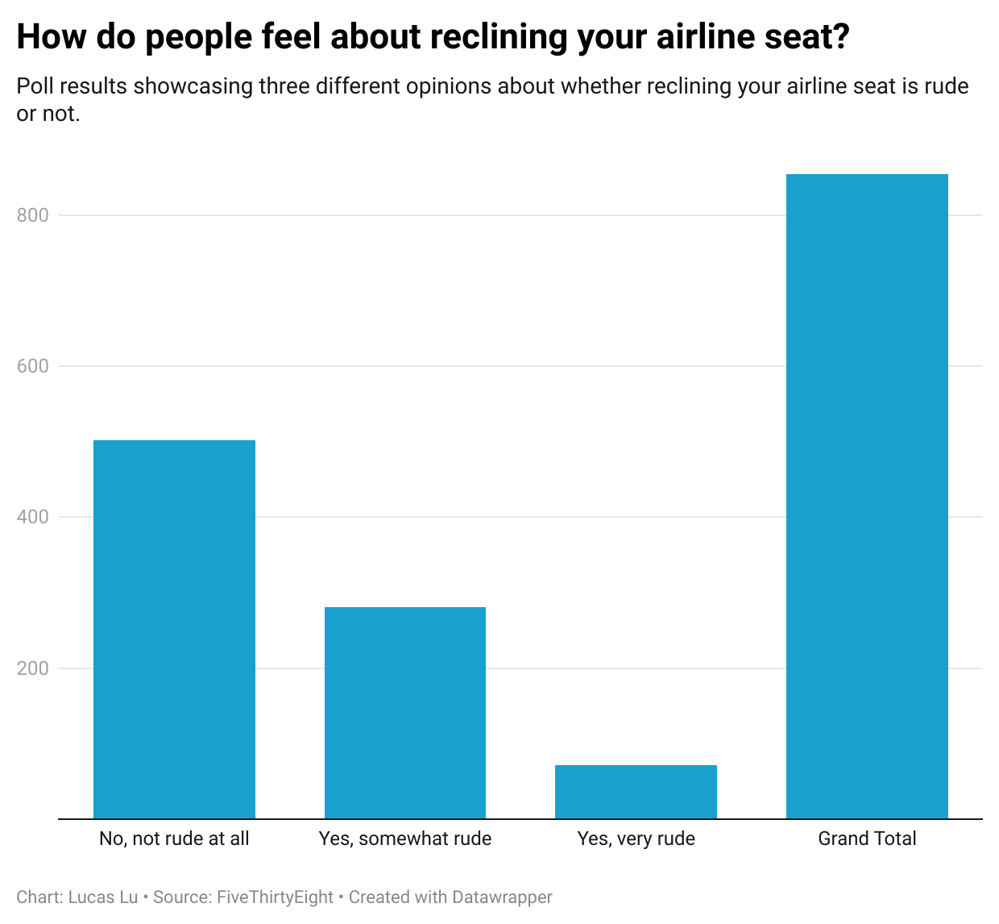

# Journalism-124
Github repository for Journalism 124

**Step 5)**
	Below is the image of the graph that I have created using the Datawrapper software:
  
  
To start the reason why I choose to do the opinions about reclining your airline seat is because I do it myself. I like to sleep on planes an thus naturally I will recline my seat. I wanted to see how many people on average would disapprove of my action. After ploting the results I will not lie and say I was a little shocked by the number of people who felt reclining your seat is somewhat rude or very rude. After a quick calculation 41% of survey responders felt that reclining your seat was either somewhat rude or very rude. This is quite a lot and I might refrain from reclining my seat in the future. 

My grpah plots out the count of how people felt about reclining your airline seat. My chart is limited by the 3 responses that were provided on the survey. None theless, my chart shows the varying amounts for each answer. By including the total bar it reveals that there is actually a significant amount of people who disaprove of seat reclining.  One thing that I found super interesting about the data is how many people stated that they have never flown before. 186 out of 1040 survey respondents stated that they have never flown before. This is 17% of the survey respondents and if the survey respondents is aiming to accurately portray a larger population than that is a lot of people who have not flown befor. I think this is very interesting and that this number was higher than I originially anticipated. 
  
